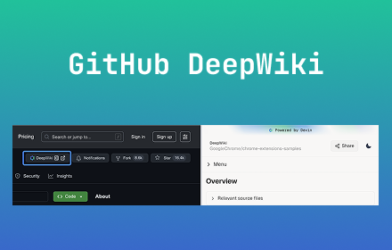
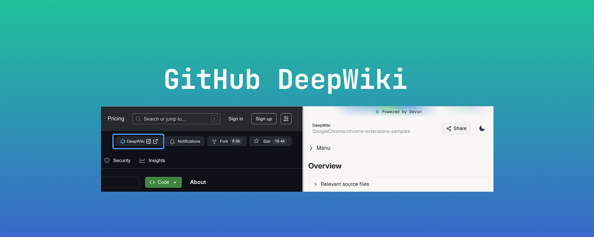

# Store listing

## Title

GitHub DeepWiki

## Summary from package

GitHub DeepWiki - link github repo to deepwiki.com

## Description

Create by tomowang with ❤️ <https://tomo.dev>

Quickly Access DeepWiki from GitHub!

This extension adds a convenient "DeepWiki" button to GitHub repository pages, providing one-click access to the repository's documentation on DeepWiki.

Features:

- Seamless GitHub integration
- One-click DeepWiki access
- Open in side panel or new tab
- Use escape key to close side panel
- Clean, GitHub-style design
- Works on all GitHub repos

Note: Unofficial extension. No affiliation with GitHub or DeepWiki.

Privacy: No data collection or tracking. Requires access to github.com only.

Open source on GitHub: <https://github.com/tomowang/github-deepwiki>

## Category

Tools

## Language

English

## Store icon

## Promo Video

## Screenshots

## Small promo tile

## Marquee promo tile

# Privacy

## Single purpose

## Permission justification

- Storage permission is required to store settings

## Data usage

None
